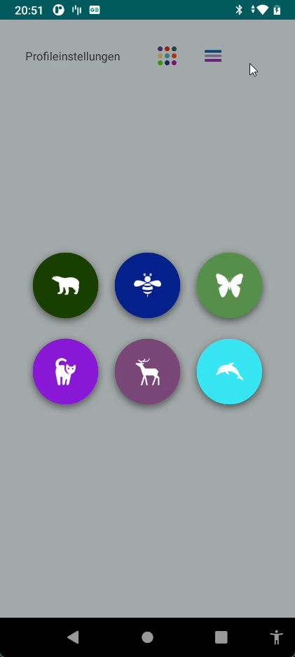
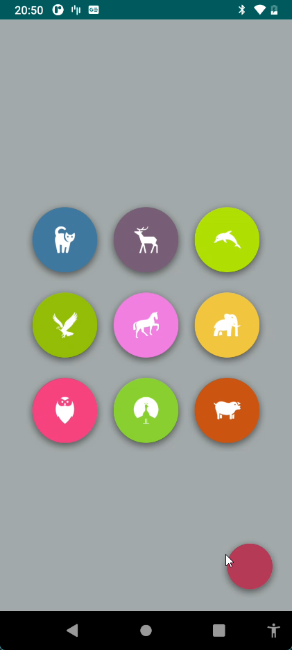
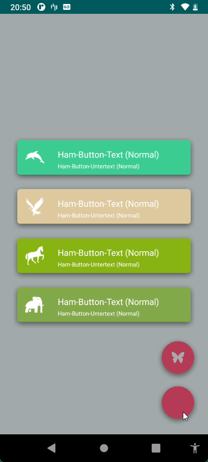
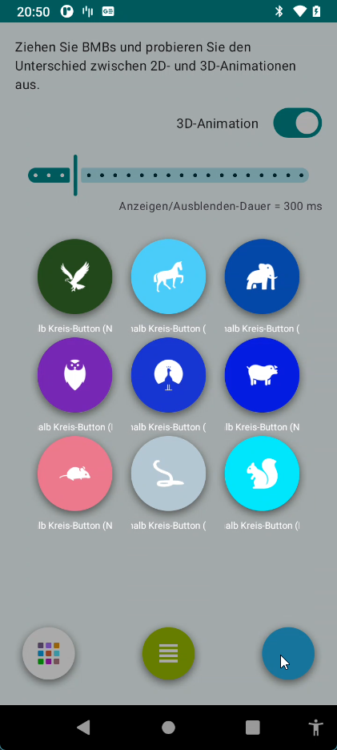
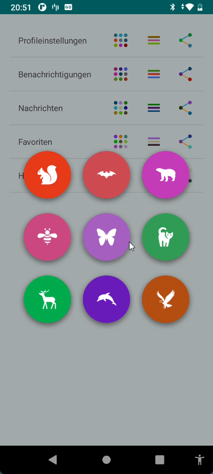
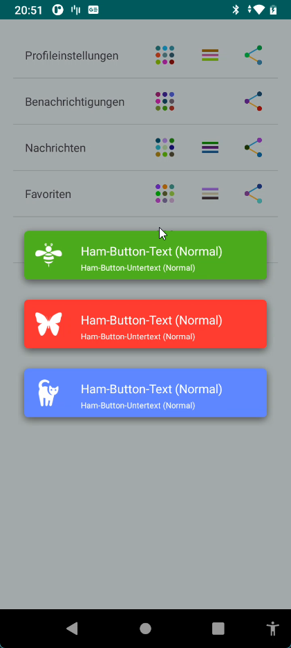
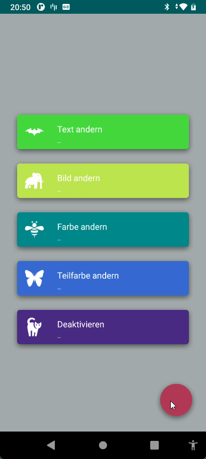

# KarSu Menu Button

An animated FAB (Floating Action Button) menu library for Android, written in **Kotlin**. KarSu Menu Button lets you create expressive, animated popup menus with various button types, animations, and layouts.

## Demo

<video src="https://private-user-images.githubusercontent.com/5566139/547308192-445fab60-1dac-466b-aa91-94742a4fef0b.mp4?jwt=eyJ0eXAiOiJKV1QiLCJhbGciOiJIUzI1NiJ9.eyJpc3MiOiJnaXRodWIuY29tIiwiYXVkIjoicmF3LmdpdGh1YnVzZXJjb250ZW50LmNvbSIsImtleSI6ImtleTUiLCJleHAiOjE3NzA2NjgwNjgsIm5iZiI6MTc3MDY2Nzc2OCwicGF0aCI6Ii81NTY2MTM5LzU0NzMwODE5Mi00NDVmYWI2MC0xZGFjLTQ2NmItYWE5MS05NDc0MmE0ZmVmMGIubXA0P1gtQW16LUFsZ29yaXRobT1BV1M0LUhNQUMtU0hBMjU2JlgtQW16LUNyZWRlbnRpYWw9QUtJQVZDT0RZTFNBNTNQUUs0WkElMkYyMDI2MDIwOSUyRnVzLWVhc3QtMSUyRnMzJTJGYXdzNF9yZXF1ZXN0JlgtQW16LURhdGU9MjAyNjAyMDlUMjAwOTI4WiZYLUFtei1FeHBpcmVzPTMwMCZYLUFtei1TaWduYXR1cmU9ZGM5OWQxOWZhNWE1NDk5MzNmN2QxMmZkOWVmNjFmMTcxMWVmMjBhZTg2NzIxZGJkOTJkYmQzZTYzZWY2YWM4NCZYLUFtei1TaWduZWRIZWFkZXJzPWhvc3QifQ.7FOlz9o4F-FrASoyKy7lWBUSlxttvVfKm35QZI8DVOE" autoplay loop muted playsinline width="300"></video>

## Screenshots

| Main Menu | Simple Circle | Ham Buttons | 3D Animation |
|:---------:|:-------------:|:-----------:|:------------:|
|  |  |  |  |

| RecyclerView | ListView + Ham | Change Button | RecyclerView + Circle |
|:------------:|:--------------:|:-------------:|:---------------------:|
|  |  |  |  |

## Features

- **4 Button Types**: Simple Circle, Text Inside Circle, Text Outside Circle, Ham (list-style)
- **8 Animation Types**: Line, Parabola (4 variants), Horizontal Throw (2 variants), Random
- **31 Ease Functions**: Sine, Quad, Cubic, Quart, Quint, Expo, Circ, Back, Elastic, Bounce, Linear (each with In/Out/InOut)
- **3D Transform Animations**: Depth effects with camera distance control
- **Flexible Layouts**: 1-9 buttons with multiple placement configurations
- **Button Alignment**: Center, Top, Bottom, Left, Right, and all 4 corner alignments
- **Draggable FAB**: Move the menu button anywhere on the screen with edge snapping
- **Share Lines**: Animated connection lines between buttons
- **Custom Positions**: Place buttons at exact coordinates
- **Fade Animations**: Fade-in/fade-out effects for surrounding views
- **Shadow & Ripple Effects**: Material Design style with customizable shadow color/offset/radius
- **Orientation Support**: Adapts to screen rotation and re-positions buttons
- **Works Everywhere**: Activity, Fragment, ActionBar, Toolbar, ListView, RecyclerView
- **Multi-Language**: English, Turkish, German
- **Runtime Changes**: Update button text, image, color at runtime with live synchronization
- **Back Press Handling**: Automatically closes menu on back button
- **Cache Optimization**: Reuse button instances for better performance
- **Battery Save Mode**: Adapts animation behavior when power save mode is active

## Requirements

- Android API 30+ (minSdk 30)
- Kotlin 2.3+
- AndroidX
- Gradle 8.13+

## Installation

Add the library module as a dependency in your `build.gradle.kts`:

```kotlin
dependencies {
    implementation(project(":ballonsmenu"))
}
```

## Usage

### 1. Simple Circle Button

The most basic button type - circle buttons with just an icon.

**XML Layout:**

```xml
<com.karsu.ballonsmenu.KarSuMenuButton
    android:id="@+id/bmb"
    android:layout_width="wrap_content"
    android:layout_height="wrap_content"
    app:bmb_buttonEnum="simpleCircle"
    app:bmb_piecePlaceEnum="piecePlace_dot_9_1"
    app:bmb_buttonPlaceEnum="buttonPlace_sc_9_1"
    app:bmb_karsuEnum="karsuLine"
    app:bmb_showMoveEaseEnum="outBack"
    app:bmb_showDuration="500" />
```

**Kotlin:**

```kotlin
val bmb = findViewById<KarSuMenuButton>(R.id.bmb)

for (i in 0 until bmb.piecePlaceEnum.pieceNumber()) {
    val builder = SimpleCircleButton.Builder()
        .normalImageRes(imageResources[i])
        .normalColorRes(colorResources[i])
        .listener { index -> Log.d("KarSu", "Button $index clicked") }
    bmb.addBuilder(builder)
}
```

### 2. Text Inside Circle Button

Circle buttons with a text label inside the circle.

```kotlin
val builder = TextInsideCircleButton.Builder()
    .normalImageRes(R.drawable.ic_example)
    .normalColorRes(R.color.colorPrimary)
    .normalText("Settings")
    .normalTextColor(Color.WHITE)
    .textSize(10)
    .listener { index -> /* handle click */ }
bmb.addBuilder(builder)
```

### 3. Text Outside Circle Button

Circle buttons with a text label below the circle.

```kotlin
val builder = TextOutsideCircleButton.Builder()
    .normalImageRes(R.drawable.ic_example)
    .normalColorRes(R.color.colorAccent)
    .normalText("Profile")
    .normalTextColor(Color.DKGRAY)
    .textSize(10)
    .textTopMargin(Util.dp2px(5f))
    .listener { index -> /* handle click */ }
bmb.addBuilder(builder)
```

### 4. Ham Button

Full-width list-style buttons with icon, title, and optional subtitle.

```kotlin
val builder = HamButton.Builder()
    .normalImageRes(R.drawable.ic_example)
    .normalColorRes(R.color.colorPrimary)
    .normalText("Settings")
    .normalTextColor(Color.WHITE)
    .subNormalText("Manage your preferences")
    .subNormalTextColor(Color.LTGRAY)
    .buttonCornerRadius(Util.dp2px(10f))
    .listener { index -> /* handle click */ }
bmb.addBuilder(builder)
```

### Controlling the Menu Programmatically

```kotlin
// Open the menu
bmb.karsu()

// Open immediately (no animation)
bmb.karsuImmediately()

// Close the menu
bmb.rekarsu()

// Close immediately (no animation)
bmb.rekarsuImmediately()

// Check state
bmb.isKarSued()      // true if menu is open
bmb.isReKarSued()    // true if menu is closed
bmb.isAnimating()    // true if currently animating
```

### Listening to Events

```kotlin
bmb.onKarSuListener = object : OnKarSuListener {
    override fun onKarSuWillShow() {
        // Menu is about to open
    }

    override fun onKarSuDidShow() {
        // Menu is fully open
    }

    override fun onKarSuWillHide() {
        // Menu is about to close
    }

    override fun onKarSuDidHide() {
        // Menu is fully closed
    }

    override fun onKarSuButtonClick(index: Int) {
        // A button was clicked at the given index
    }

    override fun onBackgroundClick() {
        // The dimmed background was clicked
    }
}
```

### Updating Buttons at Runtime

All builder properties support **live synchronization** - changes are immediately reflected on the button if it exists:

```kotlin
// Get a builder and update it
val builder = bmb.getBuilder(0) as? SimpleCircleButton.Builder
builder?.normalImageRes(R.drawable.new_icon)
builder?.normalColor(Color.RED)
builder?.unable(true)  // Disable the button
```

### Using in ListView / RecyclerView

When using inside scrollable lists, set `bmb_inList="true"`:

```xml
<com.karsu.ballonsmenu.KarSuMenuButton
    android:id="@+id/bmb"
    android:layout_width="wrap_content"
    android:layout_height="wrap_content"
    app:bmb_inList="true"
    app:bmb_karsuInWholeScreen="true"
    ... />
```

### Using in Fragment

Set `bmb_inFragment="true"`:

```xml
<com.karsu.ballonsmenu.KarSuMenuButton
    android:id="@+id/bmb"
    android:layout_width="wrap_content"
    android:layout_height="wrap_content"
    app:bmb_inFragment="true"
    ... />
```

### Draggable FAB

Make the menu button draggable with edge boundary constraints:

```xml
<com.karsu.ballonsmenu.KarSuMenuButton
    android:id="@+id/bmb"
    android:layout_width="wrap_content"
    android:layout_height="wrap_content"
    app:bmb_draggable="true"
    app:bmb_edgeInsetsLeft="10dp"
    app:bmb_edgeInsetsTop="10dp"
    app:bmb_edgeInsetsRight="10dp"
    app:bmb_edgeInsetsBottom="10dp"
    ... />
```

### 3D Transform Animation

Enable depth-based 3D rotation effects during button transitions:

```xml
<com.karsu.ballonsmenu.KarSuMenuButton
    android:id="@+id/bmb"
    android:layout_width="wrap_content"
    android:layout_height="wrap_content"
    app:bmb_use3DTransformAnimation="true"
    app:bmb_rotateDegree="720"
    ... />
```

## XML Attributes Reference

### Basic

| Attribute | Type | Description |
|-----------|------|-------------|
| `bmb_buttonEnum` | enum | Button type: `simpleCircle`, `textInsideCircle`, `textOutsideCircle`, `ham` |
| `bmb_cacheOptimization` | boolean | Reuse button instances to avoid re-creation |
| `bmb_karsuInWholeScreen` | boolean | Expand menu to fill whole screen (not just parent) |
| `bmb_inList` | boolean | Set `true` when using in ListView/RecyclerView |
| `bmb_inFragment` | boolean | Set `true` when using in Fragment |
| `bmb_backPressListened` | boolean | Close menu on back button press |
| `bmb_orientationAdaptable` | boolean | Re-layout on screen rotation |

### Button Appearance

| Attribute | Type | Description |
|-----------|------|-------------|
| `bmb_buttonRadius` | dimension | Radius of the FAB button |
| `bmb_backgroundEffect` | boolean | Show circular background on the FAB |
| `bmb_rippleEffect` | boolean | Material ripple effect on touch |
| `bmb_normalColor` | color | FAB color in normal state |
| `bmb_highlightedColor` | color | FAB color when pressed |
| `bmb_unableColor` | color | FAB color when disabled |
| `bmb_draggable` | boolean | Allow dragging the FAB |
| `bmb_edgeInsetsLeft/Top/Right/Bottom` | dimension | Drag boundary margins |

### Shadow

| Attribute | Type | Description |
|-----------|------|-------------|
| `bmb_shadowEffect` | boolean | Enable shadow under the FAB |
| `bmb_shadowRadius` | dimension | Shadow blur radius |
| `bmb_shadowColor` | color | Shadow color |
| `bmb_shadowOffsetX` | dimension | Horizontal shadow offset |
| `bmb_shadowOffsetY` | dimension | Vertical shadow offset |

### Piece (Mini-indicators on the FAB)

| Attribute | Type | Description |
|-----------|------|-------------|
| `bmb_piecePlaceEnum` | enum | Layout pattern for dot/ham indicators (e.g. `piecePlace_dot_3_1`, `piecePlace_ham_4`) |
| `bmb_dotRadius` | dimension | Radius of dot indicators |
| `bmb_hamWidth` / `bmb_hamHeight` | dimension | Size of ham-style indicators |
| `bmb_pieceCornerRadius` | dimension | Corner radius of square indicators |
| `bmb_pieceHorizontalMargin` | dimension | Horizontal gap between indicators |
| `bmb_pieceVerticalMargin` | dimension | Vertical gap between indicators |

### Animation

| Attribute | Type | Description |
|-----------|------|-------------|
| `bmb_karsuEnum` | enum | Animation trajectory: `karsuLine`, `karsuParabola_1`-`4`, `karsuHorizontalThrow_1`-`2`, `karsuRandom` |
| `bmb_showDuration` | integer | Open animation duration (ms) |
| `bmb_showDelay` | integer | Delay between each button's open animation (ms) |
| `bmb_hideDuration` | integer | Close animation duration (ms) |
| `bmb_hideDelay` | integer | Delay between each button's close animation (ms) |
| `bmb_showMoveEaseEnum` | enum | Ease function for open movement (31 options, e.g. `outBack`, `inOutElastic`) |
| `bmb_showScaleEaseEnum` | enum | Ease function for open scaling |
| `bmb_showRotateEaseEnum` | enum | Ease function for open rotation |
| `bmb_hideMoveEaseEnum` | enum | Ease function for close movement |
| `bmb_hideScaleEaseEnum` | enum | Ease function for close scaling |
| `bmb_hideRotateEaseEnum` | enum | Ease function for close rotation |
| `bmb_rotateDegree` | integer | Rotation degrees during animation |
| `bmb_use3DTransformAnimation` | boolean | Enable 3D depth animation |
| `bmb_orderEnum` | enum | Button opening order: `orderDefault`, `orderReverse`, `orderRandom` |
| `bmb_cancelable` | boolean | Close menu on background tap |
| `bmb_autoHide` | boolean | Auto-close after a button is clicked |
| `bmb_dimColor` | color | Background dim overlay color |
| `bmb_frames` | integer | Number of animation keyframes |

### Button Placement

| Attribute | Type | Description |
|-----------|------|-------------|
| `bmb_buttonPlaceEnum` | enum | Expanded button layout (e.g. `buttonPlace_sc_9_1`, `buttonPlace_ham_4`, `buttonPlace_custom`) |
| `bmb_buttonPlaceAlignmentEnum` | enum | Alignment: `center`, `top`, `bottom`, `left`, `right`, `tl`, `tr`, `bl`, `br` |
| `bmb_buttonHorizontalMargin` | dimension | Horizontal gap between expanded buttons |
| `bmb_buttonVerticalMargin` | dimension | Vertical gap between expanded buttons |
| `bmb_buttonTopMargin` / `bmb_buttonBottomMargin` | dimension | Top/bottom margins for expanded buttons |
| `bmb_buttonLeftMargin` / `bmb_buttonRightMargin` | dimension | Left/right margins for expanded buttons |

## Ease Functions

All 31 ease functions are available for move, scale, and rotate animations:

| Ease | In | Out | InOut |
|------|----|-----|-------|
| Sine | `inSine` | `outSine` | `inOutSine` |
| Quad | `inQuad` | `outQuad` | `inOutQuad` |
| Cubic | `inCubic` | `outCubic` | `inOutCubic` |
| Quart | `inQuart` | `outQuart` | `inOutQuart` |
| Quint | `inQuint` | `outQuint` | `inOutQuint` |
| Expo | `inExpo` | `outExpo` | `inOutExpo` |
| Circ | `inCirc` | `outCirc` | `inOutCirc` |
| Back | `inBack` | `outBack` | `inOutBack` |
| Elastic | `inElastic` | `outElastic` | `inOutElastic` |
| Bounce | `inBounce` | `outBounce` | `inOutBounce` |
| Linear | `linear` | | |

## Animation Types (KarSu Enum)

| Type | Description |
|------|-------------|
| `karsuLine` | Buttons move in a straight line from FAB to their positions |
| `karsuParabola_1` - `karsuParabola_4` | Buttons follow parabolic arc paths (4 directional variants) |
| `karsuHorizontalThrow_1` - `karsuHorizontalThrow_2` | Buttons are "thrown" horizontally (2 variants) |
| `karsuRandom` | Each button takes a random trajectory |

## Button Types in Detail

### SimpleCircleButton

Round buttons with only an icon. Builder supports:
- `normalImageRes()` / `normalImageDrawable()` - icon for normal state
- `highlightedImageRes()` / `highlightedImageDrawable()` - icon for pressed state
- `unableImageRes()` / `unableImageDrawable()` - icon for disabled state
- `normalColor()` / `normalColorRes()` - background color
- `buttonRadius()` - button size
- `isRound()` - circular or square shape
- `buttonCornerRadius()` - corner radius for square shape
- `rippleEffect()` - Material ripple on touch
- `shadowEffect()` - drop shadow toggle
- `imageRect()` - position and size of the icon within the button
- `imagePadding()` - padding around the icon
- `listener()` - click callback

### TextInsideCircleButton

Everything from SimpleCircleButton plus:
- `normalText()` / `normalTextRes()` - text for normal state
- `highlightedText()` / `highlightedTextRes()` - text for pressed state
- `unableText()` / `unableTextRes()` - text for disabled state
- `normalTextColor()` / `normalTextColorRes()` - text color
- `textRect()` - position and size of the text
- `textSize()` - font size (sp)
- `typeface()` - custom font
- `maxLines()` - max text lines
- `textGravity()` - text alignment (e.g. `Gravity.CENTER`)
- `ellipsize()` - text truncation mode

### TextOutsideCircleButton

Everything from TextInsideCircleButton plus:
- `textTopMargin()` - gap between circle and text below
- `textWidth()` / `textHeight()` - dimensions of the text area

### HamButton

Full-width list-style buttons with icon, title, and subtitle. Everything from TextInsideCircleButton plus:
- `subNormalText()` / `subNormalTextRes()` - subtitle text
- `subHighlightedText()` / `subHighlightedTextRes()` - subtitle when pressed
- `subNormalTextColor()` / `subNormalTextColorRes()` - subtitle color
- `subTextRect()` - subtitle position and size
- `subTextSize()` - subtitle font size (sp)
- `subTypeface()` - subtitle custom font
- `subMaxLines()` - max subtitle lines
- `containsSubText()` - show/hide subtitle
- `buttonWidth()` / `buttonHeight()` - button dimensions
- `buttonCornerRadius()` - rounded corners

## Demo App

The project includes a demo app with 22 examples organized by category:

| Category | Examples |
|----------|----------|
| **Buttons** | Simple Circle, Text Inside Circle, Text Outside Circle, Ham Button |
| **Animation** | Ease Functions, 3D Transforms, Opening Order |
| **Config** | Button Alignment, Custom Positions, Corner Radius, KarSu Example, Change Button at Runtime |
| **Features** | Draggable, Share Lines, Fade Views, Listener, Control, Orientation |
| **Layout** | ActionBar, Toolbar, ListView, RecyclerView, Fragment |

## Project Structure

```
ballonsmenu/                    # Library module (com.karsu.ballonsmenu)
  KarSuMenuButton.kt           # Main FAB menu component
  BackgroundView.kt             # Dim overlay background
  OnKarSuListener.kt            # Event listener interface
  KarSuStateEnum.kt             # Menu state management
  ExceptionManager.kt           # Configuration validation
  Util.kt                       # Helper utilities
  animation/
    AnimationManager.kt         # Animation engine
    KarSuEnum.kt                # Animation trajectory types
    EaseEnum.kt / Ease.kt       # 31 ease functions
    OrderEnum.kt                # Button opening order
    ShareLinesView.kt           # Connection lines between buttons
  karsu_buttons/
    KarSuButton.kt              # Base button class
    KarSuButtonBuilder.kt       # Base builder (images, colors, shadow)
    KarSuButtonWithTextBuilder.kt # Builder with text support
    SimpleCircleButton.kt       # Icon-only round button
    TextInsideCircleButton.kt   # Round button with inner text
    TextOutsideCircleButton.kt  # Round button with label below
    HamButton.kt                # Full-width list-style button
    ButtonPlaceEnum.kt          # Button placement configurations
    ButtonPlaceManager.kt       # Position calculation
    OnBMClickListener.kt        # Button click callback
  piece/
    KarSuPiece.kt               # Mini-indicator on the FAB
    PiecePlaceEnum.kt           # Indicator layout patterns
    PiecePlaceManager.kt        # Indicator position calculation

app/                            # Demo application
  MainActivity.kt               # Main menu with RecyclerView grid
  adapter/                      # RecyclerView adapters
  helper/
    BuilderManager.kt           # Creates demo button builders
    LocaleHelper.kt             # Runtime language switching
  demo/
    buttons/                    # Button type examples
    animation/                  # Animation examples
    config/                     # Configuration examples
    feature/                    # Feature examples
    layout/                     # Layout integration examples
```

## Build

```bash
./gradlew assembleDebug
```

## Inspiration & Credits

This project is inspired by [BoomMenu](https://github.com/Nightonke/BoomMenu) by [Nightonke](https://github.com/Nightonke). We are grateful for the original work and the creative ideas it provided. Thank you for the amazing open-source contribution that made this project possible!

## Author

**Erkan Kaplan**

## License

```
Copyright 2025 Erkan Kaplan

Licensed under the Apache License, Version 2.0 (the "License");
you may not use this file except in compliance with the License.
You may obtain a copy of the License at

    http://www.apache.org/licenses/LICENSE-2.0

Unless required by applicable law or agreed to in writing, software
distributed under the License is distributed on an "AS IS" BASIS,
WITHOUT WARRANTIES OR CONDITIONS OF ANY KIND, either express or implied.
See the License for the specific language governing permissions and
limitations under the License.
```
